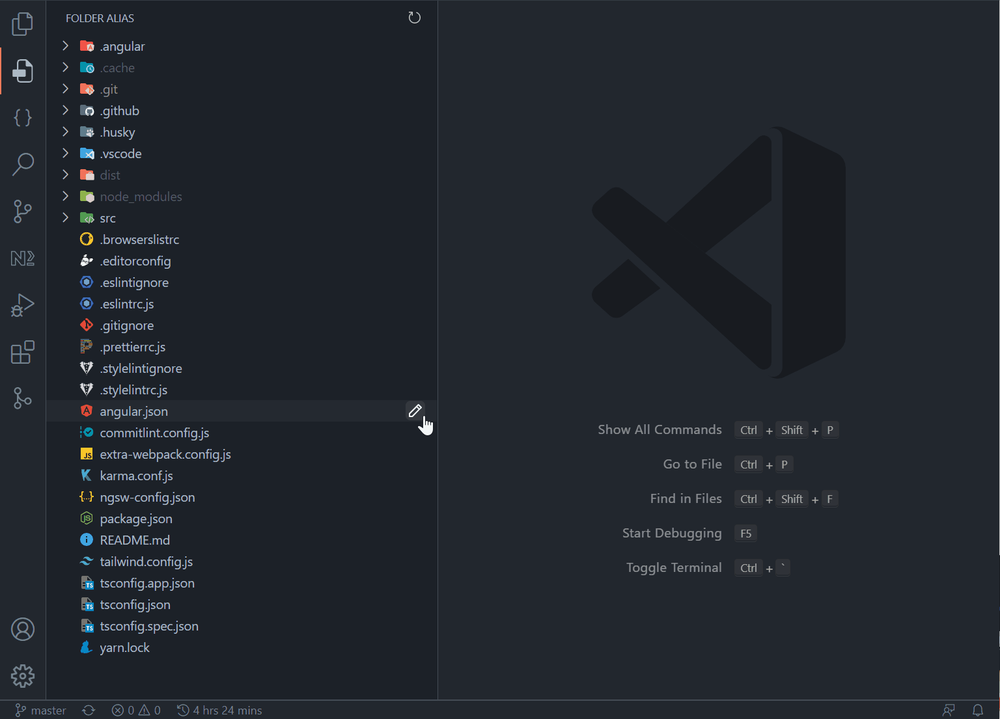

# Folder Alias

This vscode extension allows you to add remarks to the file tree on the left-hand side, helping you identify and organize your code projects better.

## Installation

1. Open VSCode and select "Extensions" from the sidebar
2. Search for "Folder Alias" and click install
3. Restart VSCode

## How to use

1. Right-click on the folder or file you want to add a remark, or alias, for
2. Select "Add Alias"
3. Enter the remark you want to add and press Enter
4. The remark will be displayed on the file tree

You can add remarks using either of the following methods:

* Right-click on the file or folder, select "Add Alias", and enter the desired remark.
* Right-click on the file or folder and select "Add Alias" to modify an existing remark.