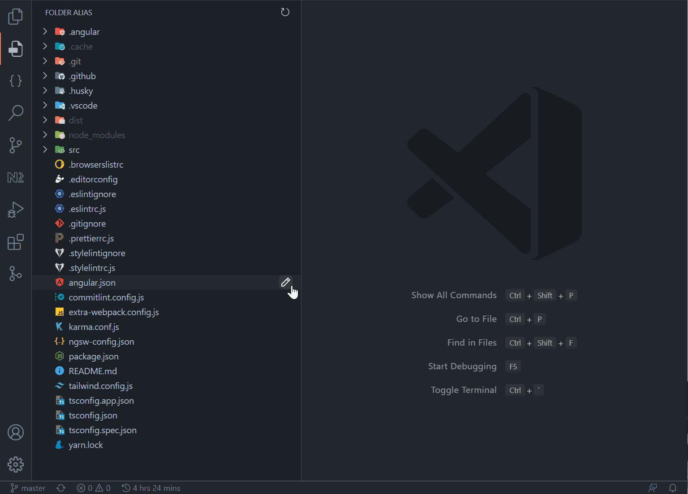

# Folder Alias - VS Code Extension

[](https://marketplace.visualstudio.com/items?itemName=rikka.folder-alias)
[](https://marketplace.visualstudio.com/items?itemName=rikka.folder-alias)
[](LICENSE)

**English** | [中文](./README.zh-CN.md)

A powerful VS Code extension that allows you to add customizable aliases and remarks to files and folders in your file tree, making project navigation and organization more intuitive.



## 🌟 Features

- **Customizable Aliases**: Add meaningful names and descriptions to any file or folder
- **Dual Configuration**: Support for both public (shared) and private (personal) aliases
- **Preset System**: Pre-built alias sets for common workspace configurations (AI agents, frontend tooling)
- **Visual Integration**: Seamlessly integrated into VS Code's file explorer
- **Easy Management**: Simple right-click interface for adding and modifying aliases
- **Persistent Storage**: Aliases are saved in JSON configuration files within your workspace

## 🚀 Installation

### From VS Code Marketplace

1. Open VS Code
2. Go to **Extensions** (`Ctrl+Shift+X` / `Cmd+Shift+X`)
3. Search for **"Folder Alias"**
4. Click **Install**
5. Reload VS Code when prompted

### Manual Installation

1. Download the latest `.vsix` file from [releases](https://github.com/Muromi-Rikka/folder-alias/releases)
2. Open VS Code
3. Go to **Extensions**
4. Click **...** (More Actions) → **Install from VSIX...**
5. Select the downloaded `.vsix` file

## 🎯 Usage

### Adding an Alias

1. **Right-click** on any file or folder in the VS Code Explorer
2. Select **"Add Alias"**
3. Choose the alias scope:
   - **Public**: Saved in `folder-alias.json` (can be committed to version control)
   - **Private**: Saved in `private-folder-alias.json` (ignored by version control)
4. Enter your desired alias/description
5. Press **Enter** to save

### Modifying an Alias

1. **Right-click** on a file/folder that already has an alias
2. Select **"Add Alias"**
3. Edit the existing text or clear it to remove the alias
4. Press **Enter** to update

### Refreshing Aliases

After manually editing the JSON configuration files, you can refresh the file explorer display:

1. **Right-click** anywhere in the Explorer
2. Select **"Refresh Aliases"**
3. Or use **Command Palette** (`Ctrl+Shift+P` / `Cmd+Shift+P`) and type "Refresh Aliases"
4. The file explorer will reload all alias configurations from the JSON files

### Presets

Presets allow you to quickly apply pre-configured alias sets for common workspace configurations. Preset aliases are loaded at runtime and have **lower priority** than your workspace config (workspace config wins over presets).

#### Available Presets

| Preset | Description |
|--------|-------------|
| **AI Agents** | Common AI agent config directories and instruction files (Claude Code, Cursor, Copilot, MCP, etc.) |
| **Frontend Tooling** | Common frontend build tools and configuration files (Vite, Webpack, ESLint, Prettier, Tailwind, etc.) |

#### Applying a Preset

1. **Right-click** on a workspace folder in the Explorer, or use **Command Palette** (`Ctrl+Shift+P`)
2. Select **"Apply Preset"**
3. Choose a preset from the list (built-in presets are marked with 📄)
4. The preset aliases will be applied to your workspace
5. Select an already-applied preset again to remove it

#### Saving Custom Presets

1. Add the aliases you want to save
2. **Right-click** on the workspace folder, or use **Command Palette**
3. Select **"Save Config as Preset"**
4. Enter a name for your preset
5. The preset is saved to `.vscode/folder-alias-presets/`

#### Deleting Custom Presets

1. **Right-click** on the workspace folder, or use **Command Palette**
2. Select **"Delete Preset"**
3. Choose a custom preset to delete

#### Preset Storage

- **Built-in presets**: Shipped with the extension (`media/presets/`)
- **User presets**: Stored in `.vscode/folder-alias-presets/<name>.json`
- **Selected presets**: Stored in `.vscode/folder-alias-selected-presets.json`

#### Multi-language Support

Presets support localization. The extension detects your workspace language and displays preset names and descriptions in the appropriate language (currently supports English and Chinese).

### File Structure

The extension supports two configuration locations with smart priority:

#### Configuration Priority

The extension will **prioritize** `.vscode` directory over root directory:

- **`.vscode/folder-alias.json`** - Public aliases (highest priority)
- **`.vscode/private-folder-alias.json`** - Private aliases (highest priority)
- **`folder-alias.json`** - Public aliases (fallback)
- **`private-folder-alias.json`** - Private aliases (fallback)

**Behavior Rules:**
- **Reading**: If `.vscode/folder-alias.json` exists, it will be used instead of root `folder-alias.json`
- **Initialization**: The extension will only create configuration files in the root directory if no corresponding files exist in `.vscode`
- **Saving**: When saving aliases, the extension will save to `.vscode` only if the corresponding file already exists there, otherwise to root directory

#### File Locations

You can organize your aliases in either location:

- **`.vscode/` directory**: Keeps your workspace root clean and organized
- **Root directory**: Traditional location, compatible with existing setups

#### Example Configuration

```json
{
  "src/components/Button": {
    "description": "🎛️ Reusable Button Component",
    "tooltip": "Primary button component with variants"
  },
  "docs/api": {
    "description": "📚 API Documentation",
    "tooltip": "REST API endpoints documentation"
  }
}
```

## 🛠️ Development

### Prerequisites

- Node.js (v24+)
- pnpm (preferred package manager)
- VS Code

### Setup Development Environment

```bash
# Clone the repository
git clone https://github.com/Muromi-Rikka/folder-alias.git
cd folder-alias

# Install dependencies
pnpm install

# Build the extension
pnpm build

# Run in development mode (with watch)
pnpm dev
```

### Available Scripts

| Command | Description |
|---------|-------------|
| `pnpm build` | Build the extension |
| `pnpm dev` | Build in watch mode for development |
| `pnpm test` | Run tests |
| `pnpm test:watch` | Run tests in watch mode |
| `pnpm test:coverage` | Run tests with coverage report |
| `pnpm lint` | Run ESLint |
| `pnpm typecheck` | Run TypeScript type checking |
| `pnpm update:gen` | Regenerate VS Code extension metadata |
| `pnpm pack` | Package the extension |
| `pnpm publish` | Publish to VS Code Marketplace |

### Debugging

1. Open the project in VS Code
2. Press `F5` to open a new Extension Development Host window
3. Make changes to the source code
4. Reload (`Ctrl+R` / `Cmd+R`) the Extension Development Host to see changes

## 📝 Configuration

### Extension Settings

The extension automatically creates and manages configuration files in your workspace. No additional settings are required.

### Workspace Integration

For team collaboration, consider adding this to your `.gitignore`:

```gitignore
# Folder Alias - Personal aliases
private-folder-alias.json
```

## 🔧 Architecture

### Core Components

- **`src/index.ts`** - Extension entry point, registers decoration provider and commands
- **`src/file-alias.ts`** - File decoration provider and alias management per workspace folder
- **`src/hooks/useWorkspaceManager.ts`** - Manages workspace folder instances and URI resolution
- **`src/hooks/useConfig.ts`** - Loads, merges, and saves public/private JSON configs with preset support
- **`src/command/add-alias.command.ts`** - Command handler for adding/modifying aliases
- **`src/command/apply-preset.command.ts`** - Command handler for applying/toggling presets
- **`src/command/save-preset.command.ts`** - Command handler for saving config as preset
- **`src/command/delete-preset.command.ts`** - Command handler for deleting user presets
- **`src/command/refresh-aliases.command.ts`** - Command handler for refreshing all aliases
- **`src/typings/preset.typing.ts`** - Preset type definitions with localization support
- **`src/utils/preset.util.ts`** - Preset utilities (load, save, localize, merge)
- **`src/utils/file.util.ts`** - File I/O utilities for configuration management
- **`src/utils/logger.util.ts`** - Logging utility

### Technologies Used

- **TypeScript** - Primary language
- **reactive-vscode** - Reactive programming for VS Code extensions
- **es-toolkit** - Modern utility library (replaces lodash)
- **destr** - Safe JSON parsing
- **pathe** - Cross-platform file path utilities
- **tsdown** - Build tool for TypeScript
- **ESLint** (antfu config) - Code linting
- **Vitest** - Testing framework

## 🤝 Contributing

Contributions are welcome! To get started:

1. Fork the repository
2. Create a feature branch: `git checkout -b feature/new-feature`
3. Make your changes
4. Run tests: `pnpm test`
5. Run linting: `pnpm lint`
6. Commit your changes and push
7. Submit a pull request

## 📄 License

This project is licensed under the [GPLv3 License](LICENSE).

## 🐛 Issues and Support

If you encounter any issues or have feature requests, please [create an issue](https://github.com/Muromi-Rikka/folder-alias/issues) on GitHub.

## 📈 Changelog

See [CHANGELOG.md](CHANGELOG.md) for a detailed history of changes and updates.

---

**Made with ❤️ by [Rikka](https://github.com/Muromi-Rikka)**
